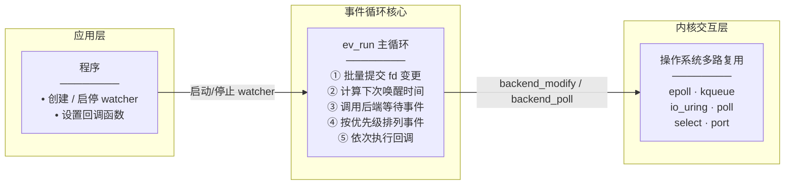

# 一、网络库

## 1.1 libev




libev是一个事件循环处理框架，通过将各种信号分别封装为不同的事件，将IO事件，定时器，和信号统一起来，统一放在事件处理这一套框架下处理。
其底层基于epoll、kqueue等操作系统提供的基础设施。

对于linux下各种IO模式目前都支持，但是windwos上目前只支持了select模式

libev其实就是reactor模式的一个实现，其内部主要包含watcher，ev_loop 以及 ev_run三个主要角色

### 1.1.1 事件循环：
对于libev，最重要的是其事件循环机制，libev 通过一个while循环一直监听并处理各种事件

事件循环的结构如下：

```
struct ev_loop

{

ev_tstamp ev_rt_now;

#define ev_rt_now ((loop)->ev_rt_now)

#define VAR(name,decl) decl;

#include "ev_vars.h"

#undef VAR

};
```


### 1.1.2 事件观察

为了方便对各种事件统一监控，libev抽象出watcher机制。


在这里libev定义了一个基类的watcher结构体ev_watcher：
```
typedef struct ev_watcher
{
  EV_WATCHER (ev_watcher)
} ev_watcher;

typedef struct ev_watcher_list
{
  EV_WATCHER_LIST (ev_watcher_list)
} ev_watcher_list;

// ev_watcher 宏
#define EV_WATCHER(type)			\
  int active; /* private */			\
  int pending; /* private */			\
  EV_DECL_PRIORITY /* private */		\
  EV_COMMON /* rw */				\
  EV_CB_DECLARE (type) /* private */
  

// ev_watcher_list 宏
#define EV_WATCHER_LIST(type)			\
  EV_WATCHER (type)				\
  struct ev_watcher_list *next; /* private */
```

c语言中没有继承的概念，但也可以使用特定的方式实现类似于继承的效果（本质上就是编译器如何对内存进行解释）：

```
typedef struct ev_io
{
  EV_WATCHER_LIST (ev_io)

  int fd;     /* ro */
  int events; /* ro */
} ev_io;
```

上面是IO事件的内存结构，继承自ev_watcher_list。因为ev_io实际内存开始位置就是ev_watcher结构的属性，所以实际上用ev_watcher类型的指针指向ev_io类型的变量也没问题。


## 1.2 libuv


## 1.3 boost.asio

这个网路库主要是基于c++，dm目前的代码如果想使用的话还需要补充上层封装

# 二、RPC框架

2.1 oceanbase 中的RPC

ob中使用libeasy 提供系统中的rpc通信框架


