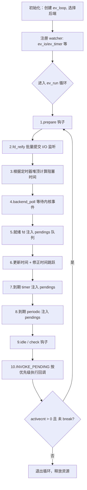

# 一、开源网络库源码解读

## 1.1 libev

libev是一个事件循环处理框架，通过将各种信号分别封装为不同的事件，将IO事件，定时器，和信号统一起来，统一放在事件处理这一套框架下处理。

libev基于reactor模式实现，整体使用流程如下：

初始化ev_loop，定义监视器和回调函数，监视器和回调函数关联，监视器和ev_loop关联，调用ev_run将ev_loop运行起来。

### 1.1.1 核心数据结构
#### 1.1.1.1 watcher

监视器包括一个基础监视器`ev_watcher`，链表节点监视器`ev_watcher_list`以及一个带时间的监视器`ev_watcher_time`

```
typedef struct ev_watcher
{
  EV_WATCHER (ev_watcher)
} ev_watcher;

// 展开后结构
typedef struct ev_watcher {
  int active;           // 表示 watcher 是否处于“活跃”状态（即已被启动）
  int pending;
  int priority;         // 如果 EV_MINPRI != EV_MAXPRI，否则不存在
  void *data;           // EV_COMMON 展开为用户数据指针
  void (*cb)(struct ev_loop *, struct ev_watcher *, int revents);
} ev_watcher;

typedef struct ev_watcher_list
{
  EV_WATCHER_LIST (ev_watcher_list)
} ev_watcher_list;

typedef struct ev_watcher_time
{
  EV_WATCHER_TIME (ev_watcher_time)
} ev_watcher_time;

// 所有 watcher 共享的成员
#define EV_WATCHER(type)           \
    int active;     /* 是否已注册到 loop */       \
    int pending;    /* 是否有待处理事件（索引+1） */ \
    EV_DECL_PRIORITY               \
    EV_COMMON       /* void *data */              \
    EV_CB_DECLARE(type)  /* 回调函数指针 */

// 链表式 watcher（IO、信号、子进程等——多个 watcher 可监控同一 fd/signal）
#define EV_WATCHER_LIST(type)      \
    EV_WATCHER(type)               \
    struct ev_watcher_list *next;

// 时间式 watcher（定时器、周期定时器）
#define EV_WATCHER_TIME(type)      \
    EV_WATCHER(type)               \
    ev_tstamp at;   /* 绝对超时时间 */

```

1）基础属性：
**`active`**：表示 watcher 是否处于“活跃”状态，不同类型的watcher含义存在区别。
- 对于 I/O、信号、prepare、check 等：只要 `active != 0` 就代表活跃。
- 对于定时器、periodic：`active` 存储的是**该 watcher 在堆中的下标**，这样可以直接定位到堆位置，便于快速调整。
- 统一使用一个整型，避免了使用额外的布尔标志，节省空间且加速判断（`if (active)` 即可）。

**`pending`**：表示该 watcher 当前是否有待处理的触发事件，以及事件在 pending 队列中的位置。
- `pending == 0`：无待处理事件。
- `pending > 0`：待处理队列中的槽位下标 + 1
- **事件合并的关键**：当同一个 watcher 在尚未被回调前再次触发，libev 可以根据 `pending - 1` 直接找到已有的 `ANPENDING` 槽位，将新的事件掩码按位或进去，避免重复入队。这既节省了 pending 队列的空间，又保证了回调不会因同一事件源的多次触发而被多次调用。

**`data`**（`EV_COMMON`）：一个 `void*` 用户数据指针，可作为上下文传递。因为 C 没有闭包，这是回调与用户数据结构绑定的惯用方式
- 一个 `void*` 用户数据指针，可作为上下文传递。因为 C 没有闭包，这是回调与用户数据结构绑定的惯用方式，由用户自定义使用。

**`cb`**：
- 回调函数指针，原型为 `void (*)(EV_P_ struct type *w, int revents)`。`type` 在宏展开时被具体化，使每种 watcher 的回调强类型匹配（如 `ev_io` 的回调为 `void (*cb)(EV_P_ ev_io *w, int revents)`）。

2）具体watcher类型
ev_io、ev_timer、ev_periodic、ev_signal、ev_child、ev_stat、ev_idle、ev_prepare、ev_check、ev_fork、ev_cleanup、ev_async等


#### 1.1.1.2 ANFD 

ANFD是被监控文件状态的描述，结构如下：

```
typedef struct {
    WL head;                // 监听该 fd 的所有 ev_io 链表
    unsigned char events;   // 当前内核已知的监听掩码
    unsigned char reify;    // 脏标志：是否需要重新同步
    unsigned char emask;    // 后端特殊标记（如 epoll EPERM）
    unsigned int egen;      // 代际计数器，丢弃过时事件
} ANFD;
```


head 表示监听者链表：
`WL`是`ev_watcher_list*`，只要有一个或多个 `ev_io` watcher 在监听这个 fd，它们的结构就会挂在这个单链表上。
有了这个链表，libev 可以快速找到：
- 该 fd 上所有活跃的 watcher，用于**合并事件掩码**（将所有 watcher 关心的读/写事件“或”起来）。
- 当内核通知该 fd 就绪时，遍历链表，**把事件精准分发给那些确实关心此事件的 watcher**。

events表示内核中的当前监听掩码：
- 记录**上一次通过 `backend_modify`（如 `epoll_ctl`）提交给内核的事件集合**。
- 在 `fd_reify` 中，libev 会重新计算该 fd 上所有 watcher 的事件并集，得到新掩码 `nev`。**只有 `nev != events` 时，才会真正调用后端去修改内核监听**。这就是减少系统调用的关键判断。

reify 脏标志：
- 当应用层调用 `ev_io_start` / `ev_io_stop` 或直接修改了 watcher 的事件掩码时，会调用 `fd_change()`

emask后端特殊状态：
- 例如 epoll 后端：如果对一个 fd 调用 `epoll_ctl` 时返回 `EPERM`（表示 epoll 不支持这个 fd，如某些 `/dev/null` 或 tty），libev 会将 `emask` 设置为 `EV_EMASK_EPERM`，并将 fd 移入一个 **eperm 列表**。在后续 `epoll_poll` 中，会轮询这些 fd，手动生成就绪事件，模拟 epoll 的行为。

egen代际计数器（epoll/iouring 等需要）：
- 每次该 fd 的监听掩码通过后端真正修改成功时，`egen` 会递增。
- 内核返回的就绪事件中通常携带用户数据（如 `epoll_event.data.u64`），libev 会将 `(fd | (uint64_t)egen << 32)` 写入其中。
- 在收到内核事件时，核对事件中的代际与 `anfds[fd].egen` 是否一致。如果不一致，说明这个事件是 **“过时”的**（比如 fd 被关闭后立刻被新连接复用，但老 fd 的事件还残留在内核队列），直接丢弃。这个机制用极低成本防止了危险的误触发。

ANFD实现了**延迟批量同步**的核心机制（`reify` + `fdchanges`），将多次 `epoll_ctl` 合并为一次。
基于ANFD结构，libev使用一个anfds数组保存所有的文件描述信息。使用fd作为数组下标，并对数组动态扩容。


#### 1.1.1.3 ANHE
ANHE是libev内定时器堆元素结构，libev 使用 **4 叉最小堆** 管理定时器或者periodic。根据编译宏 `EV_HEAP_CACHE_AT` 的不同，`ANHE` 有两种定义：

```
#if EV_HEAP_CACHE_AT
  /* 带缓存 at 的堆元素 */
  typedef struct {
    ev_tstamp at;   /* 缓存到期时间 */
    WT w;           /* 指向 ev_timer 或 ev_periodic 的指针 */
  } ANHE;

  #define ANHE_w(he)        (he).w       /* 获取 watcher 指针 */
  #define ANHE_at(he)       (he).at      /* 读取缓存的到期时间 */
  #define ANHE_at_cache(he) (he).at = (he).w->at  /* 将 watcher 的 at 复制到缓存 */
#else
  /* 不缓存 at，堆元素就是 watcher 指针本身 */
  typedef WT ANHE;

  #define ANHE_w(he)        (he)
  #define ANHE_at(he)       (he)->at     /* 需要解引用 watcher 读取 */
  #define ANHE_at_cache(he) /* 空操作 */
#endif
```

默认情况下会缓存at。因为定时器堆的核心操作是**比较节点超时时间**，而在缓存at的情况下，因为at与w处于一个内存结构中，此时一次内存访问就可以直接获取到期时间，这样可以减少cpu的cache miss，提升整体执行效率。

这里使用timers数组作为定时器的堆，具体结构如下：
```
ANHE *timers;      // 定时器堆数组
int timermax;      // 数组容量
int timercnt;      // 当前定时器数量

#define DHEAP 4
#define HEAP0 (DHEAP - 1) /* index of first element in heap */
#define HPARENT(k) ((((k) - HEAP0 - 1) / DHEAP) + HEAP0)      // 子找父 
#define UPHEAP_DONE(p,k) ((p) == (k))

// 父找子，从DHEAP * (k - HEAP0) + HEAP0 + 1 开始，共四个子节点

```

这里第一个定时器不放在下标 0，而是放在 `HEAP0 = 3`位置。
每次循环时，直接访问堆顶位置，判断是否超时并取出超时的计时器，直到堆顶不满足超时条件为止。
因为使用了四叉最小堆，所以能提供 **O(1) 获取最早到期时间**、**O(log n) 插入/删除**，同时高度更低，缓存更友好。支持数万定时器仍保持微秒级开销

#### 1.1.1.4 ANPENDING

ANPENDING表示待处理事件，它用于将已经发生但尚未执行回调的事件暂存起来，并按照优先级排序，最终由事件循环统一调度执行

```
typedef struct {
  W w;          /* 指向待回调的 watcher */
  int events;   /* 触发的事件掩码 */
} ANPENDING;

ANPENDING *pendings [NUMPRI];   /* 每个优先级对应的 ANPENDING 动态数组 */
int pendingcnt [NUMPRI];        /* 每个优先级当前待处理事件的数量 */
int pendingmax [NUMPRI];        /* 每个优先级数组的当前容量 */
```

libev 为每个优先级分配了一个**独立的待处理事件数组**，形成了一个二维数组，最外层表示优先级数组，NUMPRI是优先级的个数（例如 `EV_MAXPRI - EV_MINPRI + 1`，默认通常有 5 级）。
每个优先级对应一个动态数组，在在ev_feed_event中分配一个event并将其添加到对应优先级的动态数组中，如果这个动态数组内存不够，就动态扩容并将原本的数组拷贝到新的数组内存中。因为每个优先级数组都是连续内存，相对于链表而言遍历执行的时候cpu缓存命中率也更高

在这里，所有已触发但未执行的事件统一在此汇聚，**按优先级从高到低调度**。
同一 watcher 的重复触发通过 `pending` 字段**合并事件掩码**，既不重复分配槽位也不重复回调。？？？？？？？？


#### 1.1.1.5 fdchanges – 延迟变更列表

```
int *fdchanges;      // 动态数组，存储需要重新同步到内核的 fd 号
int fdchangemax;     // 数组的容量（元素个数上限）
int fdchangecnt;     // 当前数组中的元素数量
```

当应用程序调用 `ev_io_start`、`ev_io_stop` 或修改 watcher的事件掩码时，libev 并不会立即调用 `epoll_ctl`（或其他后端）去更新内核中的监听集。相反，它仅仅在内部的 `ANFD` 结构中标记该 fd 为“脏”（设置 `reify` 标志），并将 fd 加入 `fdchanges` 数组。真正的内核同步延迟到每一轮事件循环开始前的 `fd_reify` 阶段统一处理。

这样做有以下几个好处：
**合并多次修改**：同一 fd 在一轮循环中的任意次变动只产生一次系统调用。

**合并多个 watcher**：同一个 fd 上可能有多个 `ev_io` watcher，`fd_reify` 会自动计算所有 watcher 监听事件的并集，仅提交一次最终结果。

**消除无效操作**：比如先停止读监听再启动写监听，最终只会生成一条 `EPOLL_CTL_MOD`，而非 `DEL` + `ADD` 两次调用。


这里重点是入队以及批量操作两个步骤：
1）fd_change入队
fd_change函数通过判断 `reify` 是否为0确保每个fd在数组中只出现一次，即使同一个 fd 被多次修改，`fdchanges` 中也只会将其加入一次

2）fd_reify批量同步
把分散在应用代码中的多次 I/O 监听修改**推迟到每轮事件循环开始时统一做差异计算，将其精确地提交给内核**，从而极大减少系统调用次数


#### 1.1.1.6 ev_loop 结构体 – 全局状态容器

struct ev_loop 包含所有后端状态、watcher 数组、时间变量等，支持多重循环独立实例。

```
struct ev_loop

{

ev_tstamp ev_rt_now;

#define ev_rt_now ((loop)->ev_rt_now)

#define VAR(name,decl) decl;

#include "ev_vars.h"

#undef VAR

};
```

ev_loop 核心成员如下：
1）时间类型
```
ev_tstamp mn_now;        // 单调时钟当前时间
ev_tstamp ev_rt_now;     // 实时时钟（被定义在结构体开头）
ev_tstamp now_floor;     // 上次刷新 rt_now 时的单调时间
ev_tstamp rtmn_diff;     // 实时时钟与单调时钟的差值
```

2）文件描述
```
ANFD *anfds;            // 以 fd 为下标的 ANFD 结构数组
int anfdmax;            // 数组容量
int *fdchanges;         // 待批量同步的内核 fd 列表
int fdchangemax;        // fdchanges 容量
int fdchangecnt;        // 当前赃 fd 数量
```

3）待处理事件队列
```
ANPENDING *pendings [NUMPRI];  // 每个优先级一个动态数组
int pendingmax [NUMPRI];
int pendingcnt [NUMPRI];
int pendingpri;                 // 当前最高待处理优先级
ev_prepare pending_w;          // 一个伪 watcher，用于占位
```

4）定时器堆
```
ANHE *timers;          // ev_timer 的最小堆数组
int timermax;
int timercnt;
```

5）后端多路复用
```
int backend;                  // 当前使用的后端标识（EVBACKEND_EPOLL 等）
int backend_fd;               // 后端 fd（如 epoll fd）
ev_tstamp backend_mintime;    // 后端最小等待时间（补偿精度）
void (*backend_modify)(EV_P_ int fd, int oev, int nev);
void (*backend_poll)(EV_P_ ev_tstamp timeout);
```

在这里使用两个函数指针将 epoll、kqueue、io_uring 等底层接口封装成统一操作，使得 `ev_run` 与具体后端解耦。

6）信号与内部管道
```
int evpipe[2];               // 内部唤醒管道 fds
ev_io pipe_w;                // 管道上的 I/O watcher
EV_ATOMIC_T pipe_write_wanted;
EV_ATOMIC_T pipe_write_skipped;
EV_ATOMIC_T sig_pending;     // 是否有信号待处理
#if EV_USE_SIGNALFD
int sigfd;
ev_io sigfd_w;
sigset_t sigfd_set;
#endif
```

如果循环阻塞在 `epoll_wait` 时，使用管道跨线程唤醒
同时信号处理也依赖于这个管道


7）生命周期控制
```
int activecnt;             // 活跃 watcher 总数，决定循环是否退出
EV_ATOMIC_T loop_done;     // 退出标志（EVBREAK_CANCEL/ONE/ALL）
unsigned int origflags;    // 创建循环时的原始标志
char postfork;             // 是否需要在下一轮重建内核状态
pid_t curpid;              // 用于检测 fork 的 PID
```


设计优点：
- **数据局部性**：所有与一个事件循环相关的数据集中在同一结构体，避免全局变量和跨线程伪共享。
- **精准的时间变量**：`mn_now`（单调时钟）、`ev_rt_now`（实时时钟）、`rtmn_diff` 等缓存，避免在每次定时器检查时重复系统调用获取时间。
- **快速访问**：通过宏展开为 `loop->member` 直接访问，零额外函数调用开销。


### 1.1.2 整体执行流程
上面分析了libev 中一些关键数据结构以及对应的设计思路，现在分析整体执行流程，可以看到流程非常清晰，就是一个简单的循环：

libev 首先调用loop_init创建事件循环与后端，接着我们注册事件并添加 watcher。

**关键点**：

- **I/O watcher**：不立即调用 `epoll_ctl`，而是设置 `anfds[fd].reify = 1`，并将 fd 加入 `fdchanges` 数组。真正的内核注册被推迟到下一轮循环的 `fd_reify`。
    
- **定时器**：插入 `timers` 最小堆，设置其 `at = mn_now + after`，通过 `upheap` 维持堆秩序。
    
- **信号**：若该信号首次被监听，则设置信号处理器 / 更新 `signalfd`；watcher 被串到 `signals[signum].head` 链表上。
    

所有 watcher 启动时都会 `++activecnt`，确保循环知道“还有事要做”。


紧接着我们会开启主循环，也就是ev_run 的每一轮迭代，每轮迭代严格按以下顺序执行：

1）处理 fork 与 prepare 钩子

- 若检测到 `postfork`，调用 `loop_fork` 重新初始化各后端和 fd 状态（因为子进程中的内核描述符已失效）。
    
- 执行 **prepare watchers**：在进入阻塞前给用户一次机会修改监听集（例如重新计算事件掩码）。
    

2）fd_reify` —— 批量同步 I/O 监听

- 遍历 `fdchanges` 数组中的所有脏 fd。
    
- 对每个 fd，遍历其上的所有活跃 `ev_io` watcher，计算事件掩码并集 `nev`。
    
- 若 `nev` 与内核已知的 `anfds[fd].events` 不同，**调用一次** `backend_modify` 更新内核监听。
    
- 递增 `egen` 代际计数器，防止后续旧事件干扰。
    
- 清空 `reify` 标志，消费 `fdchanges` 数组。
    

**效果**：无论用户在上轮回调中对 fd 做了多少修改，这一轮只产生最精简的系统调用。


3）计算阻塞时间

- 从 `timers` 堆顶获取最早定时器的到期时间，计算 `waittime = 最早到期时间 - mn_now`。
    
- 同时考虑周期性定时器 (`periodics`) 的到期时间。
    
- 将 `waittime` 限制在 `backend_mintime` ~ `MAX_BLOCKTIME` 之间，并综合 `timeout_blocktime`、`io_blocktime`、是否有 idle watcher 等因素。
    
- 可选地先 `ev_sleep(sleeptime)` 释放 CPU 给其他线程。
    

4）backend_poll —— 进入内核等待事件

- 调用后端 `poll` 函数，例如 `epoll_wait(waittime)`。
    
- 内核返回就绪的 fd 集合和事件掩码。
    

5）fd_event_nocheck` —— 将就绪事件注入 pending 队列

- 遍历每个就绪 fd 的 `anfds[fd].head` 链表，对每个 `ev_io` watcher：
    
    - 检查 `egen` 是否匹配（丢弃过时事件）。
        
    - 调用 `ev_feed_event`，将 `EV_READ` / `EV_WRITE` 事件存入对应优先级的 `pendings[]` 数组。
        
    - 若该 watcher 已有 pending 事件，只合并事件掩码（`|= revents`），避免重复入队。
        

6）第二次时钟更新

- 再次调用 `time_update`，检测是否有时间跳跃。
    
- 若有跳跃，自动调整所有定时器的 `at` 或重新调度 periodic。
    

7）timers_reify` —— 处理到期定时器

- 循环弹出 `timers` 堆顶，只要 `at <= mn_now`。
    
- 若定时器有 `repeat`，则 `at += repeat` 并重新 `downheap`。
    
- 若是单次定时器，直接从堆中删除。
    
- 将 `EV_TIMER` 事件通过 `ev_feed_event` 注入 pending 队列。
    

8）`periodics_reify` —— 处理到期周期任务

- 类似定时器，但基于实时时钟 `ev_rt_now`，支持绝对时间点和自定义重调度回调。
    

9）idle 与 check 钩子

- 若没有任何 pending 事件，执行 **idle watchers**。
    
- 执行 **check watchers**，在 pending 执行前给用户最后一次全局观察机会。
    

10）EV_INVOKE_PENDING 按优先级执行回调

- 从高优先级向低优先级遍历 `pendings[]` 数组。
    
- 取出每个 `ANPENDING` 槽位，将 watcher 的 `pending` 清零，调用其回调函数 `cb`。
    
- 回调中可能修改监听、启动/停止其他 watcher、甚至嵌套调用 `ev_run`（形成递归）。
    

11）判断是否继续

- 若 `activecnt > 0` 且 `loop_done == 0` 且未设置 `EVRUN_ONCE` / `EVRUN_NOWAIT`，回到步骤 1。
    
- 否则退出循环，返回 `activecnt`。
    


最后是资源的回收和清理：
- `ev_io_stop` / `ev_timer_stop` 等从各容器（ANFD 链表、堆、信号链表）中移除 watcher，`--activecnt`。

- `ev_loop_destroy` 遍历所有优先级 `pendings`、定时器堆、fd 数组等，释放全部动态内存，调用各后端的 `destroy` 函数，关闭 `backend_fd`、`evpipe` 等描述符。


**整体流程如下：**



libev 的整个流程清晰严谨，每一步都是为了**用最小的开销、最少的系统调用，精准地响应所有就绪事件**。这种设计使它能在极高并发下，依然保持微秒级的响应和极低的 CPU 消耗。

### 1.1.3 libev性能优点：

1）延迟与批量化：`ANFD.reify` + `fdchanges` → 极致的系统调用削减。
2）最小堆：`ANHE` + 4 叉堆 → O(log N) 定时器管理，O(1) 超时计算。
3）优先级队列：`pendings` 二维数组 + 事件合并 → 保证高优响应且避免重复回调。
4）紧凑与连续存储：数组堆、pending 数组、ANFD 数组→ 缓存命中率最大化。
5）内存结构优化：wather使用两种方式，分别是包含next指针以及不包含next指针两种

### 1.1.4 一些疑问
1）为什么libev 每次积攒一批数据发送，但是整体效率还是高于每次使用epoll wait方式获取io事件？

libev**用一次昂贵的系统调用，去处理尽可能多的 I/O 就绪事件**，从而大幅摊薄每个事件的固定开销
其实新版的linux内核中使用的io_uring也是类似的思想

2）使用libev，对比直接使用裸epoll_wait方式都有哪些优点

libev具有统一的事件抽象，而裸 `epoll` 只能处理文件描述符的 I/O 就绪。

libev对系统调用的性能更加优化，包括以下几点：
- 延迟批量同步（`fd_reify`）
- 高效的定时器管理——最小堆
- 优先级队列避免饿死
- 内存与缓存友好，这里主要是指其内存结构均为数组形式，且针对缓存命中进行了优化


