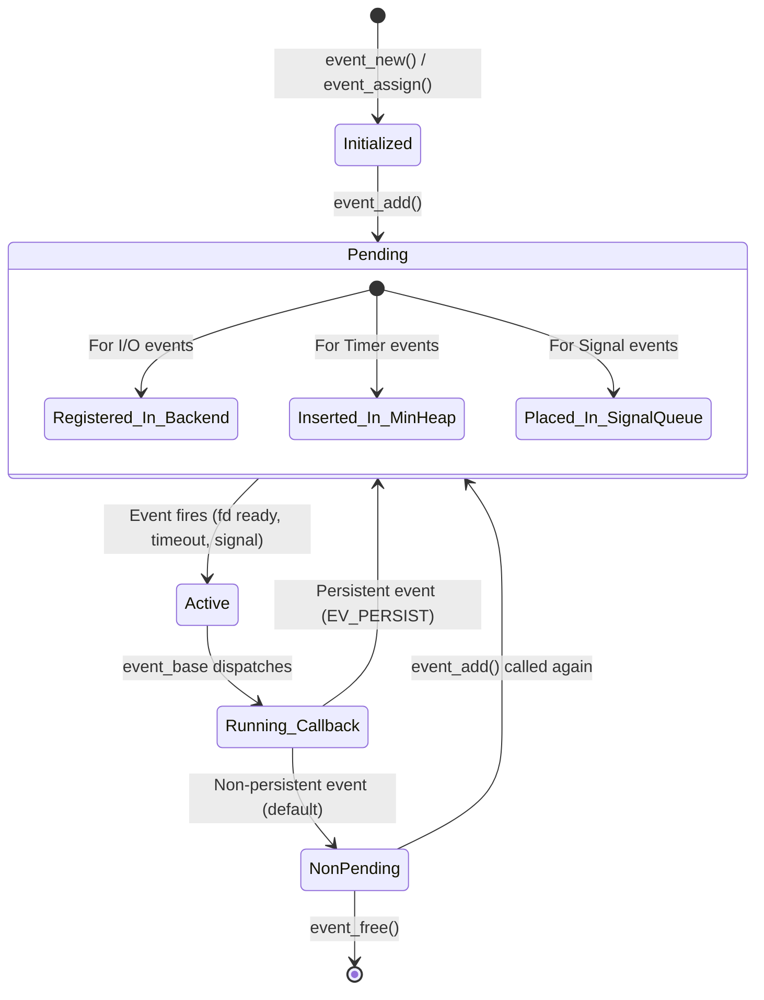
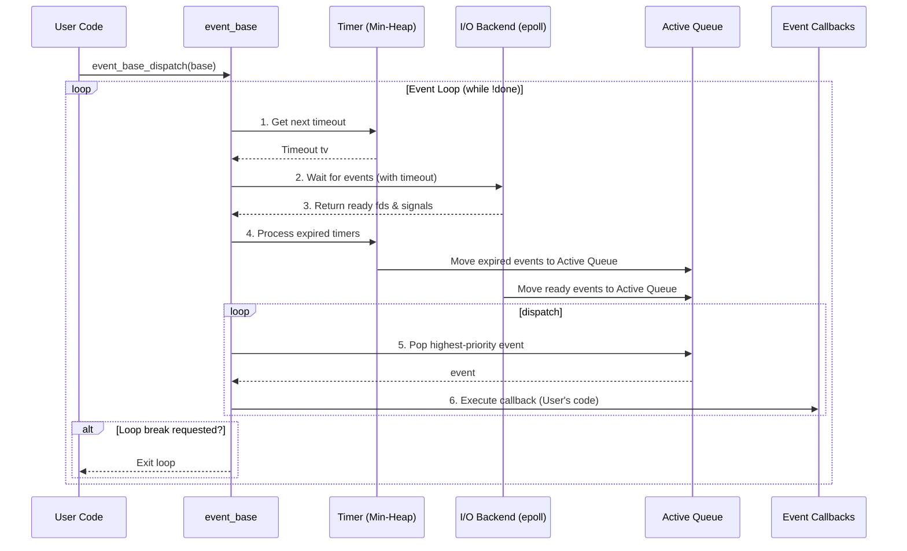
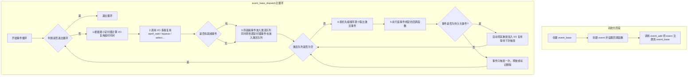
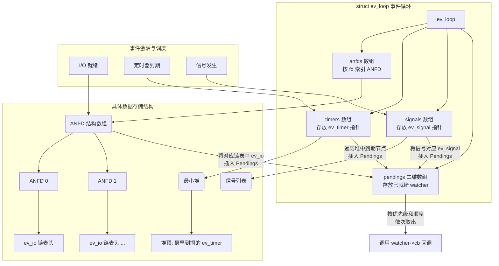
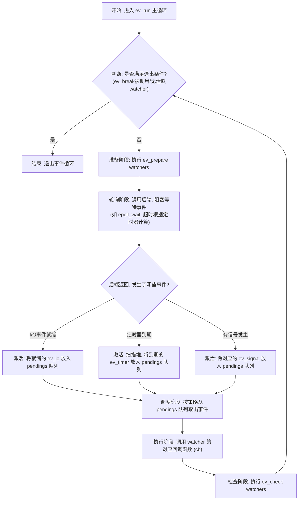
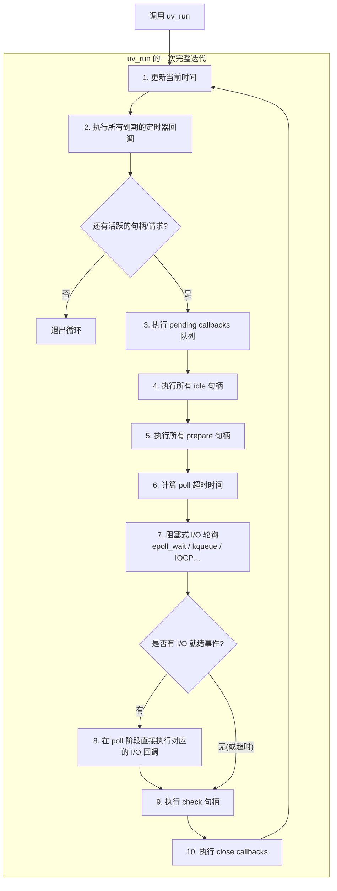
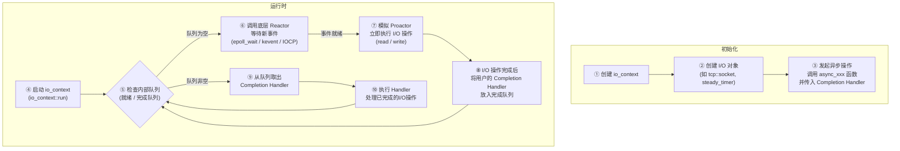
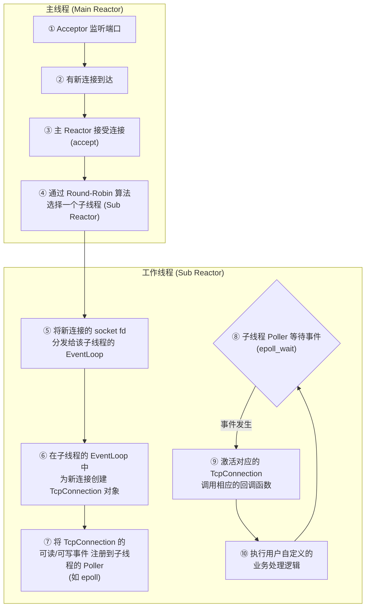

## 一、libevent

**将I/O 事件、定时器事件和信号事件这三类不同的事件源，统一抽象为同一种数据结构 (`struct event`)，并在一个事件循环 (`event_base_loop`) 中进行集中、高效的分派处理**。

### 1.1核心数据结构：统一的事件体

- **事件 (`struct event`)**：这是libevent最核心的原子单位，代表了所有被监听的事物（如一个socket、一个超时或一个信号）。它存储了句柄 (`ev_fd`)、事件标志 (`ev_events`)、超时值 (`ev_timeout`) 及回调函数 (`ev_callback`) 等所有必要信息

- **事件循环中心 (`struct event_base`)**：它是Reactor模式的直接体现，是驱动整个事件循环的引擎。它负责跟踪所有已注册和激活的事件，并通过内部的`evsel`（后端封装对象）和`evbase`（后端实例数据）与底层I/O复用机制交互。  libevent支持多种后端，在Linux上会优先使用`epoll`，并支持编译时选择。

### 1.2流程图：

#### 1.2.1事件生命周期和循环：

一个事件从诞生到被销毁，会经历 `新建` -> `pending (已注册)` -> `active (激活)` -> `pending`的循环，直到被删除。

非持久事件触发一次后需重新`add`，而持久事件则会被自动重新加入监听，简化了长期连接的代码逻辑。

#### 1.2.2 事件主循环：调度中心

**1) 计算超时**：查找定时器最小堆，获取最近将要触发的超时时间
**2) 等待事件**：将超时时间传给`epoll_wait`等后端函数，阻塞等待I/O事件或信号发生
**3) 激活事件**：后端返回后，将就绪的I/O和信号事件插入**激活队列**；同时扫描最小堆，将已超时的事件也移入队列
**4) 分派执行**：按优先级顺序，从激活队列中取出事件，执行其回调函数

#### 1.2.3 整体工作流程图：

## 二、libev

**为不同类型的事件设计了独立且精巧的“观察者”（Watcher）结构，并统一注入到一个经过深度性能优化的“事件循环”（Event Loop）中进行集中调度。**

libev摒弃了 Libevent 中庞大且性能较差的红黑树，转而采用`四叉堆（4-heap）`来管理定时器，这使得定时器相关的操作时间复杂度极低。它支持更多事件类型，且每个事件观察者（Watcher）的内存占用从 Libevent 的约152字节降至**≤56字节**。

### 2.1 核心思想：极致纯粹，性能至上

- **更纯粹的事件循环**：只关注“事件循环”本身，不提供 HTTP、bufferevent 等高级组件，功能更单一，设计更精简。
- **性能极致优化**：通过更高效的数据结构（如四叉堆），和对系统调用的精确调配（如减少`epoll_ctl`和`gettimeofday`调用次数），追求极致性能。

### 2.2 核心数据结构：事件循环与观察者
1）**`struct ev_loop` (事件循环引擎)**  
整个系统的中枢，负责驱动事件循环、管理所有已注册的观察者并调度回调。它通过宏来声明成员，动态管理内存按需扩展，避免了不必要的内存开销。同时，它也记录了循环状态、当前时间 `ev_rt_now` 等必要信息。

2）**`ev_watcher` (观察者基类)**  
所有具体事件观察者的抽象父类，包含所有观察者共享的通用字段，如`active`表示是否被激活，`pending`标记是否已就绪，`cb`为事件就绪时的回调函数，以及用户可用的`data`字段。

3）**`ev_io`, `ev_timer`, `ev_signal` (具体观察者)**  
针对不同事件源的“专用传感器”。每种观察者在基类基础上，添加了自身的关键信息。这种分离式设计，使得每个观察者都非常精简，一个 `ev_io` 和 `ev_timer` 的内存占用仅为 libevent 的 1/3 左右，不超过**56字节
`ev_io` 包含文件描述符 `fd` 和监听事件 `events`。
`ev_timer` 包含超时时间 `at` 和重复间隔 `repeat`。
`ev_signal` 则记录信号值 `signum`。

### 2.3流程图

#### 2.3.1 核心数据结构的关系图：

**图解说明：**
1）I/O 事件 (ev_io)
由 `epoll` 等后端直接监控。`anfds` 数组以 `fd` 为索引，指向一个 `ANFD` 结构，该结构内部维护了监听此 `fd` 的所有 `ev_io` 的**链表头**。事件就绪时，遍历此链表即可找到所有关注者

2）定时器事件 (ev_timer)
不直接依赖后端。所有 `ev_timer` 的指针被放入一个**最小四叉堆**（`timers`）中，堆顶即最先到期的定时器

3）信号事件 (ev_signal)
由后端异步捕获，并转换为事件通知。循环内部维护了一个 `signals` 数组来管理它们

4）就绪队列 (pendings)
这是调度前的最后集结地。一个 `watcher` 被判定为就绪后，会被放入这个**二维数组**中。第一维是**优先级**，第二维是同一优先级内的就绪 `watcher`。处理时按优先级从高到低依次取出并执行回调

#### 2.3.2 主事件循环：高性能调度核心
这是 libev 的心脏，一个不断运转的 `while` 循环，由 `ev_run` 函数启动。

**关键步骤说明：**
1）准备阶段（Prepare）：在进入阻塞等待前，执行`ev_prepare`类型的观察者，用于做准备工作。
2）轮询阶段（Poll）：计算超时时间后，调用`backend_poll`（如 `epoll_wait`）。
3）激活队列（Activate）：将`pendings`就绪队列看作“待办事项篮子”。精妙之处在于它用一个**二维数组**管理就绪事件，第一维是**优先级**（数值越小越高），第二维是同一优先级内的事件列表。
4）事件调度（Dispatch）：从`pendings`中，libev会严格按照优先级从高到低的顺序取出事件。
5）执行回调（Callback）：执行用户注册的回调函数。在回调中，用户可能添加或删除观察者，libev能正确处理这些动态变化。
6）检查阶段（Check）：执行`ev_check`观察者，常用于在循环末尾做收尾工作。

**定时器管理：**
libev 在定时器管理上做出了关键优化，使用 **最小四叉堆**（Min-4-heap）数据结构存储 `ev_timer` 观察者。相比二叉堆，四叉堆更符合现代CPU的**缓存局部性**原理，搜索范围更宽、效率更高，尤其在管理数万个定时器时，可能有**5%** 的性能优势

### 2.4 优点与总结

**优点：**

- **零拷贝优化**：通过用户态缓存时间戳，将`gettimeofday`系统调用减少到**每轮循环仅两次**，无论有多少个定时器被调整。

- **减少系统调用**：优化了对`epoll_ctl`等调用的使用，避免不必要的内核态上下文切换。

- **缓存友好**：紧凑的观察者结构和经过优化的数据结构，更好地利用了CPU缓存。

- **动态内存**：仅根据实际注册的事件量动态分配所需内存，不会像 libevent 早期版本那样预先分配大块内存。

- **优雅处理 fd 错误**：能够自动处理 `EBADF`（错误的文件描述符）等错误

**总结：**
libev 本身是**单线程**的事件循环，一个 `ev_loop` 实例设计为由单一线程驱动。但它提供了 `ev_async` 观察者，这是一种“线程间信使”，能从外部线程唤醒事件循环，实现安全、高效的线程间通信
同时libev定义了多种观察者来实现对各种事件的观察。

## 3. libuv
为了解决跨平台问题，开发者在 Linux 系统上优先采用 Libev 作为 I/O 处理的核心，而在 Windows 系统上则完全重写，采用原生的 **IOCP（I/O Completion Port）** 机制来实现异步操作，从而在不同平台上都能提供性能最优的解决方案。

#### 核心思想：跨平台的实用主义

- **跨平台优先**：在整个设计中，跨平台兼容性是首要原则。它巧妙地切割了不同平台的后端，在各自平台上使用最优的机制。
    
- **全能工具箱**：除了核心的事件循环，它内置了**线程池**来处理文件系统等耗时操作，还提供了 DNS 解析、进程管理、管道（pipe）、TTY 等多种实用功能，是一个“全栈”的系统库。
    

#### 工作流程图

Libuv 巧妙地结合了“句柄”和“请求”两种抽象，每一轮事件循环都是一个包含多个阶段的、高度结构化的过程

## 4. Boost.Asio
**它在没有原生异步 I/O 的平台上（如 Linux）用 Reactor 模式来模拟 Proactor 模式**。即 `epoll` 告诉你可以读写了，Asio 内部会立即帮你完成数据读写，然后将“操作完成”的通知放入 `io_context` 的队列，从而实现了一致的 Proactor API。

#### 核心思想：C++标准化身，Proactor先行

- **Proactor 设计**：基于“**完成通知**”模式。用户发起一个异步操作，并提供一个完成处理器（completion handler）。当 I/O 操作_完成_后，操作系统会通知应用程序，避免了不必要的等待和上下文切换。
    
- **现代 C++ 集成**：深度利用 C++11 及以后的特性，如函数对象、智能指针、`std::thread` 等，并且是 C++ 网络库的事实标准，最终将被纳入 C++ 标准库。
    

#### 工作流程图

Asio 的工作是围绕 `io_context` 这个核心组件展开的：

## 5. muduo

它采用了**主从 Reactor（Multiple Reactors）**的架构，与其**one loop per thread**的思想相辅相成。一个线程运行一个事件循环，主 Reactor（Main Reactor）所在的线程只负责处理连接建立（`accept`），然后将新连接通过 Round-Robin 算法分发给一个子 Reactor（Sub Reactor）所在的线程，该连接后续的所有 I/O 事件都由那个子线程全权负责。

#### 核心思想：Linux 服务器的最佳 C++ 实践

- **one loop per thread**：这是 Muduo 最核心的设计思想。每个线程最多只有一个事件循环，这极大地简化了并发编程的复杂性，因为每个线程内的事件处理都是串行的，无需加锁。
    
- **现代 C++ 的高效表达**：完全采用现代 C++ 编写，广泛使用 RAII、智能指针（`shared_ptr`/`unique_ptr`）和函数对象（`std::function`/`std::bind`）来管理资源和回调，极大地提升了代码的安全性和可维护性。
    

#### 工作流程图

Muduo 的智能和高效，充分体现在其多线程模型上：

