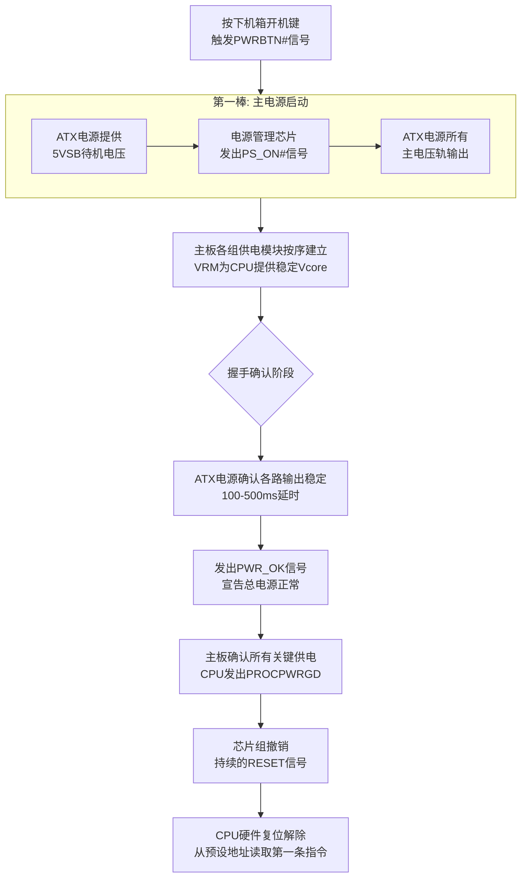

# 1.整体认知

### 第一环：通电——从混沌到稳定的物理起始

按下电源键，并非直接开机，而是启动了一个严密的**电源时序**。

1. **电压建立**：电流最先激活主板上的**电压调节模块**，将电源供应的12V、5V等转换为CPU、内存等精密部件所需的多路稳定低压。
    
2. **信号同步**：当所有电压稳定后，VRM向主板发送关键的 **`POWER_GOOD`** 信号。此信号之前，CPU一直被 **`RESET`** 信号强制在复位状态，硬件逻辑电路不执行任何操作。
    
3. **解除复位**：`POWER_GOOD` 信号让主板撤销 `RESET`。CPU内部硬件逻辑立刻将核心寄存器（如指令指针IP）硬编码为特定值，指向一个预设的物理地址，准备执行第一条指令。
    

至此，**无序的电流转化为有序的、可被指令控制的逻辑电路状态。**

### 第二环：固件——硬件与软件的第一次握手

CPU上电瞬间处于古老的**实模式**，直接运行在硬件上的第一个软件是**固件**。

1. **BIOS阶段**：CPU从 `0xFFFF0` 处执行一条跳转指令，到BIOS真正的程序入口。BIOS随后执行**加电自检**，初始化基础硬件，构建内存映射等关键数据。
    
2. **UEFI阶段**：现代UEFI固件更加复杂，能直接识别文件系统，并利用高级特性如保护模式编程。
    

固件的核心使命是：**从众多存储设备中找到唯一合法的“引导管理器”**，并将控制权交出。

### 第三环：引导——掌控权的有序交接

固件扫描启动设备，加载位于磁盘固定位置的**引导加载程序**。

1. **MBR方式**：加载磁盘的第一个扇区（512字节），这极小的一段代码负责找到并加载第二阶段的完整引导程序（如GRUB）。
    
2. **UEFI方式**：直接从ESP分区加载指定的大尺寸 `.efi` 文件，更简洁。
    

引导程序了解文件系统，能从 `/boot` 目录中找到**操作系统内核**（如 `vmlinuz`）和一个临时的**内存磁盘**加载到内存。**操作系统内核正式进入内存，取得控制权。**

### 第四环：内核初始化——在“空”硬件上建立软件世界

这是最根本的转变，操作系统内核在完全“裸机”上创造秩序。

1. **切换CPU模式**：内核首要任务是从实模式切换到保护模式，启用分页机制，彻底掌握内存控制权，从此CPU和所有后续程序都将工作在一个可控制的“虚拟”环境中。
    
2. **初始化核心子系统**：依次初始化物理/虚拟内存管理器，创建系统的第一个任务——`idle`进程，并建立中断系统——特别是设置好定时器中断。这具有决定性意义，正是这个周期性中断，使得我们之前讨论的“调度器可以寄生执行”成为可能。
    
3. **启动第一个用户进程**：创建“祖先”`init`进程，从内核态到用户态的**决定性一跳**。它标志着CPU开始执行一个处于Ring 3受限模式下的程序，系统正式进入“多任务”状态。
### 第五环：稳态运行——你之前认知的一切开始生效

`init`进程启动后，我们讨论过的所有机制开始运转，系统进入稳态循环。

1. **世界建立**：`init`（如 `systemd`）根据配置启动所有后台服务，并启动登录界面，计算机构建起完整的用户交互环境。
    
2. **“任务”模型生效**：任何程序运行，包括你启动的命令行，都基于我们深度讨论过的模型：内核为其创建 `task_struct`，分配虚拟地址空间。此时，进程或线程就是我们讨论的“逻辑上的独立虚拟计算机”。
    
3. **调度器的“心跳”**：定时器中断持续发生。每次中断，我们讨论的寄生调度器就会运行，执行时钟更新、负载计算，并在必要时通过上下文切换，让不同任务分时共享CPU。
    
4. **多核并行**：此前讨论的多核并行机制协同工作：每核独立的本地运行队列实现高效并行调度，跨核心负载均衡和锁机制安全地迁移任务，缓存一致性协议同步数据。这个机制让整个系统高效运转。

至此，完整的认知链条闭合：  
**电能**激活了**硬件电路**，**固件**唤醒了**硬件并找到引导**，**引导程序**加载了**操作系统内核**，**内核**利用**中断、页表和调度器**（你熟悉的那些机制）创建并管理**一个个运行中的任务**，最终在**多核CPU**上（通过你熟悉的并行机制）呈现出整个数字世界的有序运行。

# 2.电信号传递到cpu上
从你按下机箱开机键，到 CPU 真正开始执行第一条指令，是一段被精心设计、环环相扣的“发令枪”接力赛。

为了让你更直观地理解，我把它分成了四个环环相扣的阶段。

### ⚙️ 第一环：待机与触发 (Standby & Trigger)

你可能以为没开机时主板是完全静止的，实际上，它一直在“待命”。

- **待机供电 (5VSB)**：只要接通电源，**ATX电源**就会立刻输出一路**+5VSB**的待机电压。这好比电脑的“生命线”，专门给那些需要时刻监测开机信号的低功耗电路供电。
    
- **触发开机 (PWRBTN#)**：当你按下开机键，这个动作会瞬间拉低主板上名为**PWRBTN#**的信号。主板上的**电源管理芯片**（通常是PCH或嵌入式控制器）会捕获这个微小的电平变化。
    
- **唤醒主电源 (PS_ON#)**：确认是合法的开机信号后，电源管理芯片会向ATX电源发出**PS_ON#**信号。
    

### 📈 第二环：主电源与核心电压建立 (Main Power & VCore)

收到“开闸”指令，电脑的“心脏”——主电源和CPU供电系统，开始有序启动。

- **提供主电压**：ATX电源内部的主变换器立刻激活，开始输出**+3.3V、+5V、+12V**等所有主电压，为内存、硬盘、风扇等所有主要部件供电。
    
- **专供CPU核心电压 (VCore)**：此时，**VRM (Voltage Regulator Module) 电压调节模块**登上舞台，它负责将+12V电压精确转换为CPU所需的低压大电流核心电压**Vcore**。VRM的启动和输出，是整个上电时序中最关键、也相对靠后的一步。
    

### 🤝 第三环：“一切就绪”的握手信号 (The "All OK" Handshake)

电力建立后，关键的“握手”环节开始，确保所有设备都处在健康状态。

- **提供PWR_OK信号**：作为总电源，ATX会持续监控其输出的所有电压。确认各路电压都已稳定（这个过程大约延迟**100-500ms**）后，它会发出一个**PWR_OK**信号给主板，宣告：“我这边一切正常。”
    
- **传递“电源好”信号链**：这引发了一连串“确认”动作。板载的重要电源模块（如给PCH、内存供电的）也都确认正常后，主板会向CPU发出**PROCPWRGD**信号。这是CPU复位前的最后确认。
    

### 🚀 第四环：启动CPU的最后一步——撤销复位 (Releasing the CPU Reset)

万事俱备，只欠东风。CPU终于要登场了。

- **保持复位状态**：事实上，从通电那一刻开始，芯片组就一直在对CPU施加一个持续有效的**RESET**信号，强迫CPU停止工作并清空内部寄存器至已知状态。
    
- **解除复位封锁**：直到收到PROCPWRGD信号，芯片组才终于决定撤销发给CPU的**CPURST#**总复位信号。这意味着，CPU在硬件层面被正式“激活”了。
    

复位的撤销，就像扣动了发令枪的扳机。CPU在经历了从混沌到有序的毫秒级准备后，它的硬件程序计数器将被强制指向一个固定的内存地址（如`0xFFFFFFF0`），去读取并执行它的第一条指令，正式拉开我们所熟知的软件世界的序幕。

