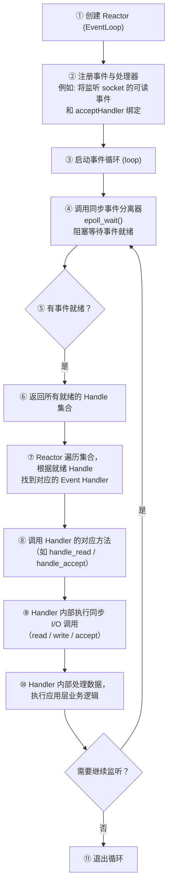
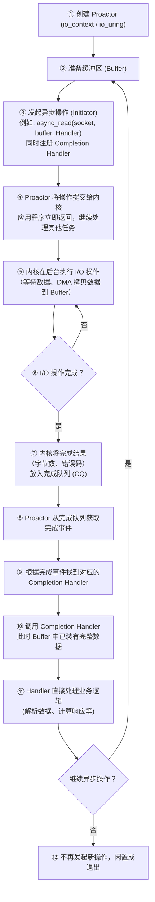

## 一、Reactor 模式

Reactor 的核心是**事件就绪通知**，基于同步非阻塞 I/O 的并发模型。由一个事件循环（Event Loop）驱动，负责监听多个 I/O 事件源（如 socket），当事件就绪时立即分派给相应的处理器（Handler），**由应用自己完成真正的 I/O 操作**。

总结为一句话： 一个事件循环（eventloop），以事件驱动（event-driven）和事件回调方式实现业务的逻辑。

==应用程序负责同步执行 I/O，但绝不阻塞等待。==

### 1.1 核心组件
**Handle（句柄）：**
句柄是操作系统管理的资源，也就是事件源，通常有文件描述符 fd、socket、文件、信号这几种表现形式。

**Synchronous Event Demultiplexer（同步事件分离器）：**
同步事件分离器是一个阻塞等待的函数，负责返回一组已经就绪的句柄。通常表现为`select`、`poll`、`epoll`、`kqueue`等。

**Reactor（反应器）：**
反应器是事件循环的大总管，负责调用分离器获取就绪事件，并将其分派给对应的处理器。通常表现为`EventLoop`（muduo）、`event_base`（libevent）。

**Event Handler（事件处理器接口）：**
事件处理器接口是定义处理事件的回调接口，通常表现为`std::function<void()>`、`Callback` 接口等。

**Concrete Event Handler（具体事件处理器）：**
具体事件处理器用于实现处理器接口，执行实际业务逻辑，通常为用户定义的 `TcpConnection` 回调、`accept` 回调等。

### 1.2 标准工作流程（epoll）：

**关键步骤解释:**

- **步骤⑧-⑨**：这正是 Reactor 和 Proactor 的本质区别所在。当 Reactor 告诉你“可读”时，你必须在 Handler 里亲自调用 `read()`。因为是非阻塞 I/O，可能只读到一部分数据，你需要自己管理缓冲区和粘包拆包。
    
- **步骤④**：`epoll_wait` 是阻塞等待的，但它会一直等到**至少有一个事件就绪**才会返回，所以 CPU 不会空转，效率极高。
    
- **步骤②中的注册**：通常在服务启动时，对于监听 socket，注册的是 `acceptHandler`；对于已连接 socket，注册的是 `readHandler` 和连接断开时的 `closeHandler`。

### 1.3 高效的原因
**避免上下文切换与锁竞争**  
Reactor 通常采用**单线程**事件循环（或者 `one loop per thread` 模式）。在一个线程内所有事件处理都是串行的，无需给状态加锁，极大地降低了并发编程的复杂度和 CPU 切换开销。
   
**连接与计算分离**  
网络服务中，绝大多数连接在绝大多数时间里都是**空闲的**（如等待用户点击）。Reactor 用极少的线程管理成千上万个空闲连接，只有在数据到来时才花 CPU 去处理。这恰好击中了高并发的核心矛盾。
   
**非阻塞 I/O 避免“一人卡死全屋等”**  
所有的 I/O 操作都设为非阻塞。如果某个 `read` 只读到半个消息，它会立刻返回，让 Reactor 继续处理下一个就绪事件，不会让整个循环被一个慢速客户端卡住。

### 1.4 特点

- **I/O 由应用层同步执行**  
    处理器收到“可读”通知后，需要自行调用 `read()`、`recv()` 等系统调用。这些系统调用通常是非阻塞的，但仍是**同步 I/O**——数据从内核缓冲区拷贝到用户空间是发生在这个调用中的。
    
- **单线程驱动模型，逻辑清晰**  
    通常一个线程运行一个事件循环，按序处理就绪事件。这种模型天然避免了复杂加锁，调试相对容易。
    
- **需要非阻塞 I/O 和缓冲区管理**  
    应用必须处理“半读半写”的情况：比如只读到了 100 字节，而消息边界需要 4 字节的长度头，应用层必须自己组装、缓存和解析。
    
- **容易陷入“回调地狱”**  
    当一个业务逻辑需要多步 I/O 操作串联时，会出现多层回调嵌套。
    
- **跨平台能力极强**  
    几乎所有操作系统都提供了 `select`/`poll`/`epoll`/`kqueue` 等同步事件分离器，实现 Reactor 天然跨平台。
    
**典型代表库：**  
`libevent`、`libev`、`muduo`，以及 `Redis` 和早期 `Nginx` 的设计，都遵循原生 Reactor 模型。

## 二、Proactor 模式

Proactor（前摄器）模式是一种**基于异步 I/O 的并发模型**。它由应用程序**主动发起**一个异步 I/O 操作，然后立即返回；当操作系统在后台将数据**完整读入**用户提供的缓冲区后，会通知应用程序，并触发相应的**完成处理器 (Completion Handler)**，此时数据已经就绪，应用程序可以直接使用。

**核心思想：**
只负责发起指令和处理结果，中间的等待和执行全部交给操作系统这个“管家”去做

**关键特征：I/O 操作由内核全权执行，应用程序只处理“已完成”的结果。**

### 2.1 核心组件

**Initiator（发起者）：**
发起异步操作，并注册完成处理器，在调用 `async_read(socket, buffer, handler)` 的代码中体现。

**Asynchronous Operation Processor（异步操作处理器）：**
执行实际的 I/O 操作，通常由内核完成。表现为Windows IOCP、Linux `io_uring` 的内核部分。

**Completion Handler（完成处理器）：**
处理异步操作完成后的结果。表现为用户传入的回调函数或协程续点。

**Proactor（前摄器）：**
从内核获取完成事件，并分派给对应的 Completion Handler。对应`io_context`（Asio）、`io_uring` 的 CQ 消费循环

**Asynchronous Operation（异步操作）：**
抽象的一次 I/O 任务。对应`async_read`、`async_write` 返回的操作对象。

**Buffer（缓冲区）：**
预先提供给内核的，用来存放读取数据的内存。

### 2.2 标准工作流程（以 io_uring / IOCP 为例）

**关键步骤解释：**

- **步骤③-④**：发起 `async_read` 后，应用**不会阻塞等待数据**，而是立刻去干别的事。这是异步 I/O 的最大优势。
    
- **步骤⑤**：内核默默地做完了所有脏活累活——等待网络数据到达，然后通过 DMA（直接内存访问）将数据从网卡拷贝到用户预先提供的 Buffer 中。**应用线程完全没有参与这个等待和数据搬运过程**。
    
- **步骤⑩**：当 Handler 被调用时，数据已经在 Buffer 里了。你不需要再调用 `read()`，直接检查 `bytes_transferred` 就可以使用数据。这极大地简化了编程模型。

### 2.3 高性能原因
1）**极致的上下文切换削减**：
在 Reactor 中，一次完整的数据读取至少需要两次通知：`epoll_wait` 告知可读 → 应用调用 `read()`。而 Proactor 只会在**数据全部准备好后**通知一次。理想情况下，一次 I/O 交互仅发生一次上下文切换。

2）**线性、直观的编程模型**：  
在 Reactor 里，你可能需要在 `on_read` 回调里写复杂的缓冲区管理、粘包处理逻辑，代码呈碎片化。而在 Proactor 中，你可以这样写（以 Asio 协程为例）：

这种写法是**顺序的、线性的**，就像同步代码一样直观，极大降低了心智负担。

 3）**天然适配现代硬件和操作系统**：
Proactor 能让操作系统发挥出**DMA、内核多线程、NVMe 设备**等的最大潜力。内核可以并行地准备多个 I/O，而应用程序只需在完成后被唤醒，将 CPU 资源完全让给业务计算。

4）**避免“半读半写”困扰**：
内核保证，当 Completion Handler 被调用时，你请求读取的 **2000 字节**要么已经全部就绪，要么就是一个确定的错误。你不需要面对 `read()` 只返回了 500 字节的尴尬情况。

#### 特点

- **I/O 由内核异步执行**  
    读取操作在内核中完成，数据已拷贝到用户提供的缓冲区，处理器拿到的是一个已经完成的结果，无需再执行 `read()`。
    
- **更少的上下文切换**  
    理想情况下，一次完整的 I/O 操作只涉及一次从发起调用到完成处理的上下文切换（实际 Windows IOCP 确实如此）。
    
- **编程模型更线性**  
    异步发起一个操作，然后直接定义它“完成时做什么”，逻辑流程更像同步代码的写法（如 `async_read` + handler）。
    
- **需要操作系统深度支持**  
    真正意义上的 Proactor 需要操作系统提供完善的异步 I/O 接口，如 Windows 的 **IOCP**。Linux 原生的 AIO 存在很多限制，因此 Linux 平台上的 Proactor 通常用 **Reactor + 用户态缓冲区** 来模拟。
    
- **模拟 Proactor 的开销**  
    在 Linux 下，`Boost.Asio` 先通过 `epoll` 获知可读，然后立即在内部同步执行 `read` 并将结果打包，再投递给用户的完成处理器。这样在用户视角仍是 Proactor API，但底层多了一次内核到用户态的拷贝和一次额外的函数调用。

**典型代表：**  
Windows IOCP 是原生 Proactor；`Boost.Asio` 跨平台采用 Proactor 风格 API，在 Windows 上直接使用 IOCP，在 Linux 上使用 Reactor 模拟。

## 核心区别对比表

|对比维度|Reactor|Proactor|
|---|---|---|
|**触发哲学**|被动反应：“**可以**做了”|主动提交：“**已经做完了**”|
|**I/O 执行者**|应用程序亲自执行 `read()`/`write()`|操作系统内核执行|
|**通知时机**|数据就绪（但还未读取）|整个操作完成（数据已就绪）|
|**编程复杂度**|需要处理非阻塞 I/O、缓冲区管理和部分读写|只需处理完整的消息，逻辑清晰|
|**多线程支持**|通常单线程，多 Reactor 模式需小心管理|内核天然并行，应用层可轻松多线程消费完成事件|
|**性能瓶颈**|可能在 `read`/`write` 系统调用和缓冲区拷贝上消耗 CPU|内核 DMA 拷贝数据，用户态零参与，极限性能更高|
|**操作系统依赖**|几乎所有系统都支持 `select`/`poll`/`epoll`|强依赖操作系统：Windows IOCP、Linux `io_uring`|
|**模拟实现**|无需模拟，直接封装|**在缺乏异步 API 的系统上，常由 Reactor 在底层模拟**（如 Linux 的 Asio 用 epoll 模拟 Proactor）|
